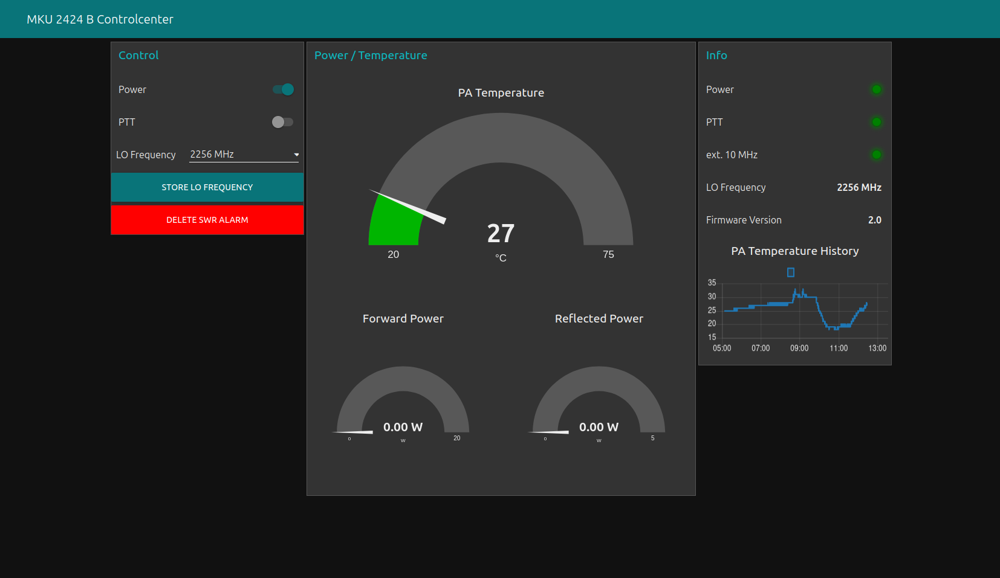

# MKU2424B-Dashboard

This is a Node-RED implementation of a dashboard for the 2.4GHz up-converter by Kuhne Electronics.



The flow polls the serial interface every two seconds and updates the values in the dasboard. The settings for the serial port are:

```
Baud Rate: 115.200
Data Bits: 8
Parity:    None
Stop Bits: 1
No Flow Control
```

This works with firmware version 2.0 of the converter. Other firmware versions have to been tested (yet). The configuration for the serial port has to be adjusted.


## Requirements

* node-red
* node-red-contrib-ui-led
* node-red-dashboard
* node-red-node-serialport

## Contributing

Contributors are welcome to file a pull request against the dev branch of this repository.
